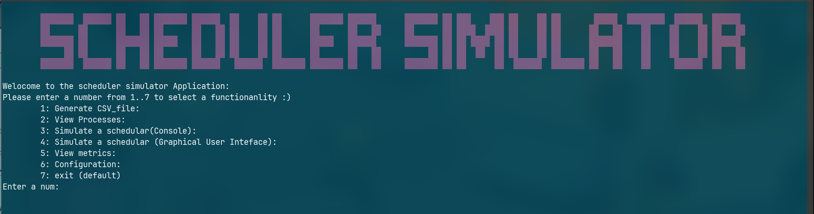

# schedular_semulator
This is a university project about creating C application that simulates the execution of multiple processes using different scheduling algorithms ( RR,FIFO ...)
## Notes: 
* dataStruct folder contains the queue data stucture (header file and src file) 
* display_mangar floder contains all the function that is related to the display ( colors, update_bar function) (`console`) ... 
* graphics display floder that handeles the graphical display using GTK library (`GUI`). 
* process_config folder is a module that handles math  operations and process related functions such as radom genration... 
* file manipulation folder is a module that is responsible for the file manip (closing, editing, ... ) files.
* scheduling algorithms is folder that contains the implementation of the secheduling algos (FIFO, RR, ...).
* Myscripts folder constains bash scripts: 
	- `instal_app.sh`: installs the application localy in your computer under `/usr/bin/`
	- `uninstall.sh`: unsintall the application. 
	- `install_dpendencies.sh`: check if the GTK library is installed, if not instal it. 
	- `remove_comments.sh`: remove commentes and white spaces (this is module called later in the `search_and_clean.sh` ).
	- `search_and_clean.sh`: parses the project structure looking for .c and .h files and then calls the `remove_comments` function. 

## A video:  enjoy 🙂 !

## set up envireonment for C programming
- To install GCC 

`sudo apt install build-essential`

- for make: 

`sudo apt install make`

- now you are ready to begin, just clone the repo: 

`git clone https://github.com/Onizuka09/projet_se.git`

##  set GTK-30:
to install GTK-3 jut run: 

`sudo apt install libgtk-3-dev`

## Installation 
1- `make` 

2- `./schedular_semulator`

## Github Link 
LINK: https://github.com/Onizuka09/projet_se.git
